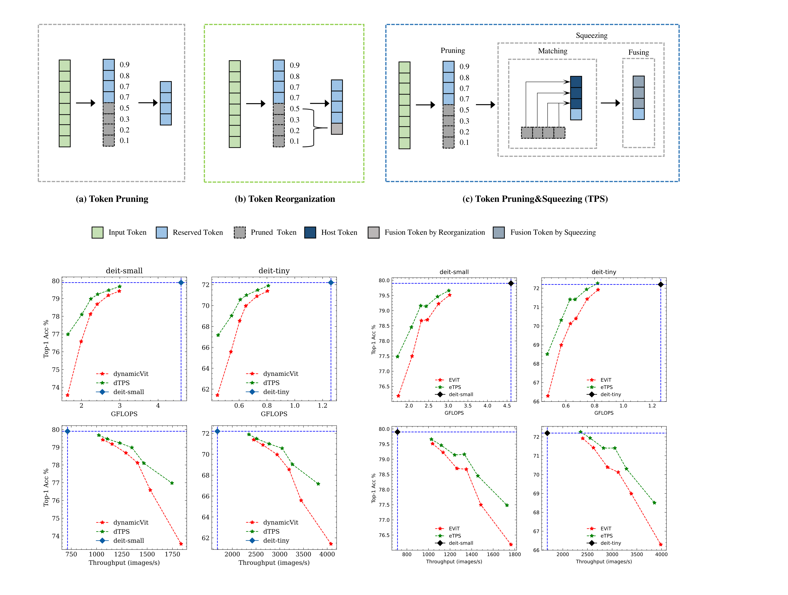

This repo is the official implementation of the CVPR2023 paper: Joint Token Pruning and Squeezing Towards More Aggressive Compression of
Vision Transformers. 

# [Joint Token Pruning and Squeezing Towards More Aggressive Compression of Vision Transformers]
## Framework & Comparison
<div style="text-align:center"></div>

## Requirements

```
conda env create -f environment.yml
```

## Training & Evaluation


Train dTPS-DeiT on a 8-gpu machine using shell scripts in ./scripts:

```
bash scripts/finetune_dtps_deit_s.sh
```
you can modify hyperparams in the .sh scripts, including the location index of pruned layers and token keep ratio.

## Liscense
TPS-CVPR2023 is released under the Apache 2.0 license. See [LICENSE](LICENSE) for details.